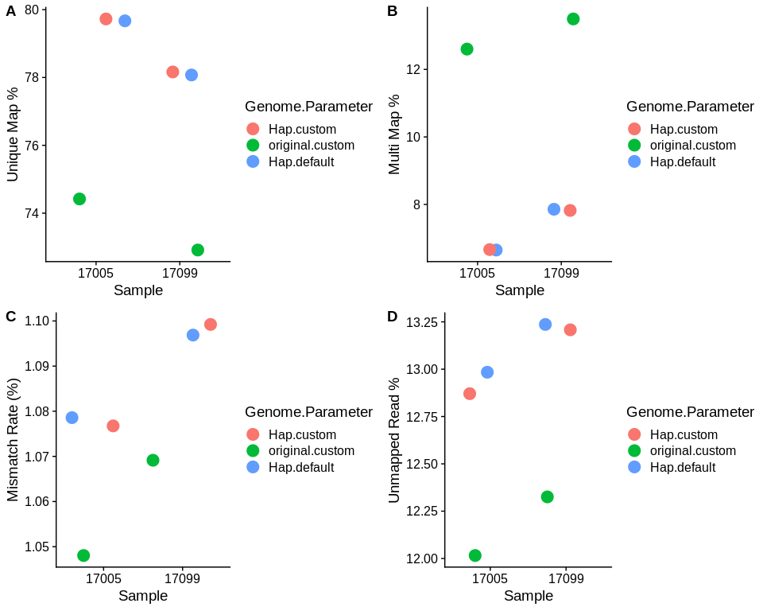
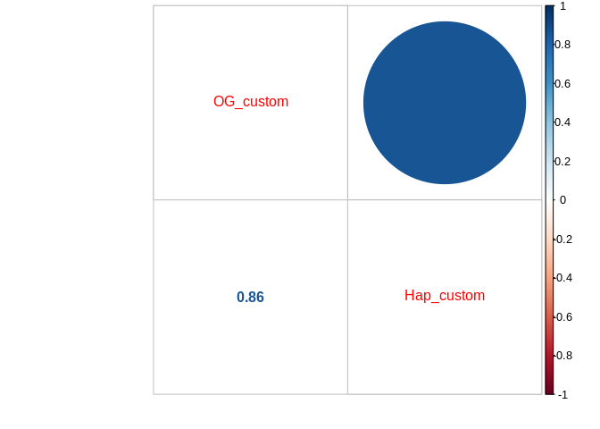
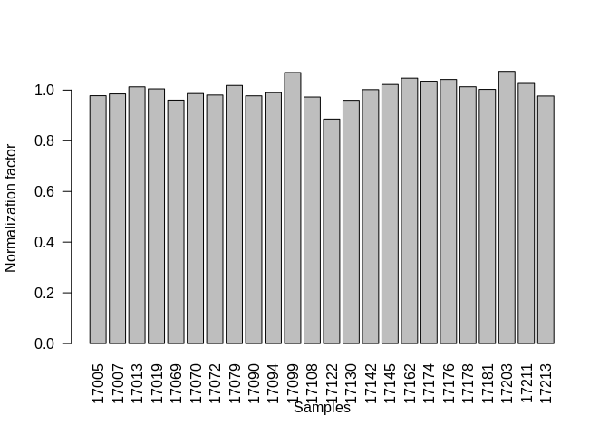
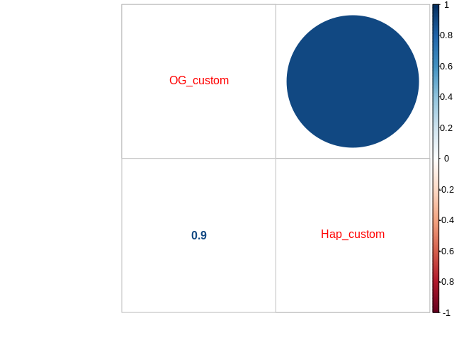
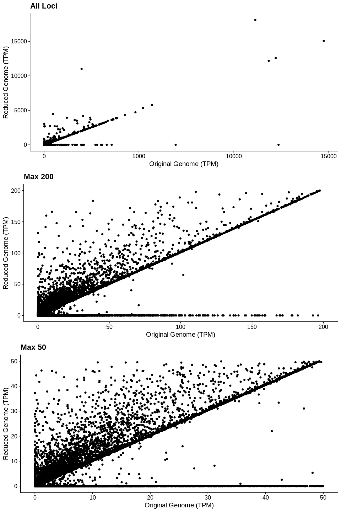

Two Sample RNA-seq sample comparison
================
adowneywall
7/9/2020

## STAR Mapping Comparison

<div style="border: 1px solid #ddd; padding: 0px; overflow-y: scroll; height:250px; overflow-x: scroll; width:800px; ">

<table class="table" style="margin-left: auto; margin-right: auto;">

<thead>

<tr>

<th style="text-align:left;position: sticky; top:0; background-color: #FFFFFF;">

</th>

<th style="text-align:left;position: sticky; top:0; background-color: #FFFFFF;">

Sample\_Unique

</th>

<th style="text-align:left;position: sticky; top:0; background-color: #FFFFFF;">

Sample

</th>

<th style="text-align:left;position: sticky; top:0; background-color: #FFFFFF;">

Genome

</th>

<th style="text-align:left;position: sticky; top:0; background-color: #FFFFFF;">

Parameters

</th>

<th style="text-align:left;position: sticky; top:0; background-color: #FFFFFF;">

InputReads

</th>

<th style="text-align:left;position: sticky; top:0; background-color: #FFFFFF;">

UniqueReads

</th>

<th style="text-align:left;position: sticky; top:0; background-color: #FFFFFF;">

UniqueReadPercent

</th>

<th style="text-align:left;position: sticky; top:0; background-color: #FFFFFF;">

totalSplices

</th>

<th style="text-align:left;position: sticky; top:0; background-color: #FFFFFF;">

MisMatchRate

</th>

<th style="text-align:left;position: sticky; top:0; background-color: #FFFFFF;">

MultiMapReads

</th>

<th style="text-align:left;position: sticky; top:0; background-color: #FFFFFF;">

MultiMapReadPercent

</th>

<th style="text-align:left;position: sticky; top:0; background-color: #FFFFFF;">

UnMappedMismatchPercent

</th>

<th style="text-align:left;position: sticky; top:0; background-color: #FFFFFF;">

UnMappedShortPercent

</th>

</tr>

</thead>

<tbody>

<tr>

<td style="text-align:left;">

1

</td>

<td style="text-align:left;">

17005\_Hap\_default

</td>

<td style="text-align:left;">

17005

</td>

<td style="text-align:left;">

Hap

</td>

<td style="text-align:left;">

default

</td>

<td style="text-align:left;">

29019229

</td>

<td style="text-align:left;">

23134476

</td>

<td style="text-align:left;">

79.7

</td>

<td style="text-align:left;">

25080333

</td>

<td style="text-align:left;">

1.08

</td>

<td style="text-align:left;">

1929366

</td>

<td style="text-align:left;">

6.65

</td>

<td style="text-align:left;">

0.00

</td>

<td style="text-align:left;">

13.0

</td>

</tr>

<tr>

<td style="text-align:left;">

3

</td>

<td style="text-align:left;">

17005\_Hap\_custom

</td>

<td style="text-align:left;">

17005

</td>

<td style="text-align:left;">

Hap

</td>

<td style="text-align:left;">

custom

</td>

<td style="text-align:left;">

29019229

</td>

<td style="text-align:left;">

23128293

</td>

<td style="text-align:left;">

79.7

</td>

<td style="text-align:left;">

25077651

</td>

<td style="text-align:left;">

1.08

</td>

<td style="text-align:left;">

1936988

</td>

<td style="text-align:left;">

6.67

</td>

<td style="text-align:left;">

0.00

</td>

<td style="text-align:left;">

12.9

</td>

</tr>

<tr>

<td style="text-align:left;">

5

</td>

<td style="text-align:left;">

17005\_original\_custom

</td>

<td style="text-align:left;">

17005

</td>

<td style="text-align:left;">

original

</td>

<td style="text-align:left;">

custom

</td>

<td style="text-align:left;">

29019229

</td>

<td style="text-align:left;">

21592189

</td>

<td style="text-align:left;">

74.4

</td>

<td style="text-align:left;">

23433957

</td>

<td style="text-align:left;">

1.05

</td>

<td style="text-align:left;">

3658588

</td>

<td style="text-align:left;">

12.6

</td>

<td style="text-align:left;">

0.00

</td>

<td style="text-align:left;">

12.0

</td>

</tr>

<tr>

<td style="text-align:left;">

2

</td>

<td style="text-align:left;">

17099\_Hap\_default

</td>

<td style="text-align:left;">

17099

</td>

<td style="text-align:left;">

Hap

</td>

<td style="text-align:left;">

default

</td>

<td style="text-align:left;">

29468692

</td>

<td style="text-align:left;">

23039810

</td>

<td style="text-align:left;">

78.1

</td>

<td style="text-align:left;">

24748387

</td>

<td style="text-align:left;">

1.10

</td>

<td style="text-align:left;">

2313982

</td>

<td style="text-align:left;">

7.85

</td>

<td style="text-align:left;">

0.00

</td>

<td style="text-align:left;">

13.2

</td>

</tr>

<tr>

<td style="text-align:left;">

4

</td>

<td style="text-align:left;">

17099\_Hap\_custom

</td>

<td style="text-align:left;">

17099

</td>

<td style="text-align:left;">

Hap

</td>

<td style="text-align:left;">

custom

</td>

<td style="text-align:left;">

29468692

</td>

<td style="text-align:left;">

23045655

</td>

<td style="text-align:left;">

78.2

</td>

<td style="text-align:left;">

24747168

</td>

<td style="text-align:left;">

1.10

</td>

<td style="text-align:left;">

2307283

</td>

<td style="text-align:left;">

7.83

</td>

<td style="text-align:left;">

0.00

</td>

<td style="text-align:left;">

13.2

</td>

</tr>

<tr>

<td style="text-align:left;">

15

</td>

<td style="text-align:left;">

17099\_original\_custom

</td>

<td style="text-align:left;">

17099

</td>

<td style="text-align:left;">

original

</td>

<td style="text-align:left;">

custom

</td>

<td style="text-align:left;">

29468692

</td>

<td style="text-align:left;">

21509701

</td>

<td style="text-align:left;">

72.9

</td>

<td style="text-align:left;">

23169681

</td>

<td style="text-align:left;">

1.07

</td>

<td style="text-align:left;">

3998499

</td>

<td style="text-align:left;">

13.5

</td>

<td style="text-align:left;">

0.00

</td>

<td style="text-align:left;">

12.3

</td>

</tr>

</tbody>

</table>

</div>

<!-- -->

## RSEM Comparison (sample 17005)

``` r
setwd("~/Github/updatedOysterTranscriptomeMappingComparison/")
OG_RSEM <- read.delim("data/samples/originalGenome_customParameters/17005_.genes.results.txt")
Hap_RSEM <- read.delim("data/samples/haploTigGenome_customParameters/17005.genes.results.txt")
# TPM
tpmMat <- data.frame(OG_custom=OG_RSEM$TPM,Hap_custom=Hap_RSEM$TPM)
# Length
lengthMat <- data.frame(OG_custom=OG_RSEM$length,Hap_custom=Hap_RSEM$length)
# Expected Count
ExpCountMat <- data.frame(OG_custom=OG_RSEM$expected_count,Hap_custom=Hap_RSEM$expected_count)
```

### CountSummary

``` r
#Number of genes with at least 1 TPM - original genome
sum(tpmMat$OG_custom > 1)
```

    ## [1] 20598

``` r
#Number of genes with at least 1 TPM - reduced genome
sum(tpmMat$Hap_custom > 1)
```

    ## [1] 17908

### Correlations

**TPM (Transcripts Per
Million)**

``` r
corrplot.mixed(cor(tpmMat))
```

<!-- -->

**Gene
Length**

``` r
corrplot.mixed(cor(lengthMat))
```

<!-- -->

**Expected
Count**

``` r
corrplot.mixed(cor(ExpCountMat))
```

<!-- -->

### TPM - Plot (Sample 17005, custom parameters, genome comparison)

``` r
p1 <- ggplot(tpmMat,aes(x=OG_custom,y=Hap_custom)) + 
  geom_point() +
  labs(x="Original Genome (TPM)", y = "Reduced Genome (TPM)",title="All Loci") +
  theme_cowplot()

p2 <- ggplot(tpmMat,aes(x=OG_custom,y=Hap_custom)) + 
  xlim(0,200) + ylim(0,200) +
  labs(x="Original Genome (TPM)", y = "Reduced Genome (TPM)",title="Max 200") +
  geom_point() +
  theme_cowplot()

p3 <- ggplot(tpmMat,aes(x=OG_custom,y=Hap_custom)) + 
  xlim(0,50) + ylim(0,50) +
  labs(x="Original Genome (TPM)", y = "Reduced Genome (TPM)",title="Max 50") +
  geom_point() +
  theme_cowplot()

plot_grid(p1,p2,p3,nrow = 3)
```

    ## Warning: Removed 755 rows containing missing values (geom_point).

    ## Warning: Removed 3132 rows containing missing values (geom_point).

<!-- -->
