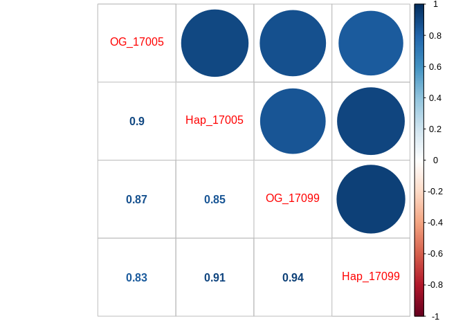

Comparing genomes by mapping RNA-seq data
================
adowneywall
7/9/2020

## Background

These 24 samples were part of an ocean acidification experiment looking
at transcriptomic response in C. virginica mantle tissue under different
experimental OA scenarios. The currently available oyster genome was
used to analyze this data. Here, we compare the impact of using either
that original genome on NCBI or the partially masked genome created by
Jon Puritz.

## Overview

In this script I compare mapping outputs using STAR. I used a custom set
of parameters (more info on the notes markdown), however, comparison of
default to custom parameters showed parameterization had little effect
on mapping. Next I also compare RSEM outputs from samples mapped with
either the original genome or the masked genome. In this analysis I also
do a quick differential expression analysis similar to the one performed
originally on this data to determine if the new mapping led to the
discovery of any
DEGs.

## STAR Mapping Comparison

<table class="table" style="margin-left: auto; margin-right: auto;">

<thead>

<tr>

<th style="text-align:left;">

Sample\_Unique

</th>

<th style="text-align:left;">

Sample

</th>

<th style="text-align:left;">

Genome

</th>

<th style="text-align:left;">

Parameters

</th>

<th style="text-align:left;">

InputReads

</th>

<th style="text-align:left;">

UniqueReads

</th>

<th style="text-align:left;">

UniqueReadPercent

</th>

<th style="text-align:left;">

totalSplices

</th>

<th style="text-align:left;">

MisMatchRate

</th>

<th style="text-align:left;">

MultiMapReads

</th>

<th style="text-align:left;">

MultiMapReadPercent

</th>

<th style="text-align:left;">

UnMappedMismatchPercent

</th>

<th style="text-align:left;">

UnMappedShortPercent

</th>

</tr>

</thead>

<tbody>

<tr>

<td style="text-align:left;">

17005\_Hap\_default

</td>

<td style="text-align:left;">

17005

</td>

<td style="text-align:left;">

Hap

</td>

<td style="text-align:left;">

default

</td>

<td style="text-align:left;">

29019229

</td>

<td style="text-align:left;">

23134476

</td>

<td style="text-align:left;">

79.7

</td>

<td style="text-align:left;">

25080333

</td>

<td style="text-align:left;">

1.08

</td>

<td style="text-align:left;">

1929366

</td>

<td style="text-align:left;">

6.65

</td>

<td style="text-align:left;">

0.00

</td>

<td style="text-align:left;">

13.0

</td>

</tr>

<tr>

<td style="text-align:left;">

17099\_Hap\_default

</td>

<td style="text-align:left;">

17099

</td>

<td style="text-align:left;">

Hap

</td>

<td style="text-align:left;">

default

</td>

<td style="text-align:left;">

29468692

</td>

<td style="text-align:left;">

23039810

</td>

<td style="text-align:left;">

78.1

</td>

<td style="text-align:left;">

24748387

</td>

<td style="text-align:left;">

1.10

</td>

<td style="text-align:left;">

2313982

</td>

<td style="text-align:left;">

7.85

</td>

<td style="text-align:left;">

0.00

</td>

<td style="text-align:left;">

13.2

</td>

</tr>

<tr>

<td style="text-align:left;">

17005\_Hap\_custom

</td>

<td style="text-align:left;">

17005

</td>

<td style="text-align:left;">

Hap

</td>

<td style="text-align:left;">

custom

</td>

<td style="text-align:left;">

29019229

</td>

<td style="text-align:left;">

23128293

</td>

<td style="text-align:left;">

79.7

</td>

<td style="text-align:left;">

25077651

</td>

<td style="text-align:left;">

1.08

</td>

<td style="text-align:left;">

1936988

</td>

<td style="text-align:left;">

6.67

</td>

<td style="text-align:left;">

0.00

</td>

<td style="text-align:left;">

12.9

</td>

</tr>

<tr>

<td style="text-align:left;">

17007\_Hap\_custom

</td>

<td style="text-align:left;">

17007

</td>

<td style="text-align:left;">

Hap

</td>

<td style="text-align:left;">

custom

</td>

<td style="text-align:left;">

30013589

</td>

<td style="text-align:left;">

23660985

</td>

<td style="text-align:left;">

78.8

</td>

<td style="text-align:left;">

26567153

</td>

<td style="text-align:left;">

1.11

</td>

<td style="text-align:left;">

2120860

</td>

<td style="text-align:left;">

7.07

</td>

<td style="text-align:left;">

0.00

</td>

<td style="text-align:left;">

13.1

</td>

</tr>

<tr>

<td style="text-align:left;">

17013\_Hap\_custom

</td>

<td style="text-align:left;">

17013

</td>

<td style="text-align:left;">

Hap

</td>

<td style="text-align:left;">

custom

</td>

<td style="text-align:left;">

29692373

</td>

<td style="text-align:left;">

23394665

</td>

<td style="text-align:left;">

78.7

</td>

<td style="text-align:left;">

24348811

</td>

<td style="text-align:left;">

1.08

</td>

<td style="text-align:left;">

2310945

</td>

<td style="text-align:left;">

7.78

</td>

<td style="text-align:left;">

0.00

</td>

<td style="text-align:left;">

12.3

</td>

</tr>

<tr>

<td style="text-align:left;">

17019\_Hap\_custom

</td>

<td style="text-align:left;">

17019

</td>

<td style="text-align:left;">

Hap

</td>

<td style="text-align:left;">

custom

</td>

<td style="text-align:left;">

32740256

</td>

<td style="text-align:left;">

26177797

</td>

<td style="text-align:left;">

79.9

</td>

<td style="text-align:left;">

28263794

</td>

<td style="text-align:left;">

1.07

</td>

<td style="text-align:left;">

2151804

</td>

<td style="text-align:left;">

6.57

</td>

<td style="text-align:left;">

0.00

</td>

<td style="text-align:left;">

12.4

</td>

</tr>

<tr>

<td style="text-align:left;">

17069\_Hap\_custom

</td>

<td style="text-align:left;">

17069

</td>

<td style="text-align:left;">

Hap

</td>

<td style="text-align:left;">

custom

</td>

<td style="text-align:left;">

30377144

</td>

<td style="text-align:left;">

23743595

</td>

<td style="text-align:left;">

78.1

</td>

<td style="text-align:left;">

24134189

</td>

<td style="text-align:left;">

1.08

</td>

<td style="text-align:left;">

2323318

</td>

<td style="text-align:left;">

7.65

</td>

<td style="text-align:left;">

0.00

</td>

<td style="text-align:left;">

13.2

</td>

</tr>

<tr>

<td style="text-align:left;">

17070\_Hap\_custom

</td>

<td style="text-align:left;">

17070

</td>

<td style="text-align:left;">

Hap

</td>

<td style="text-align:left;">

custom

</td>

<td style="text-align:left;">

29347797

</td>

<td style="text-align:left;">

22945970

</td>

<td style="text-align:left;">

78.1

</td>

<td style="text-align:left;">

24378222

</td>

<td style="text-align:left;">

1.06

</td>

<td style="text-align:left;">

2020445

</td>

<td style="text-align:left;">

6.88

</td>

<td style="text-align:left;">

0.00

</td>

<td style="text-align:left;">

13.9

</td>

</tr>

<tr>

<td style="text-align:left;">

17072\_Hap\_custom

</td>

<td style="text-align:left;">

17072

</td>

<td style="text-align:left;">

Hap

</td>

<td style="text-align:left;">

custom

</td>

<td style="text-align:left;">

26488969

</td>

<td style="text-align:left;">

20114454

</td>

<td style="text-align:left;">

75.9

</td>

<td style="text-align:left;">

20752595

</td>

<td style="text-align:left;">

1.06

</td>

<td style="text-align:left;">

1890588

</td>

<td style="text-align:left;">

7.14

</td>

<td style="text-align:left;">

0.00

</td>

<td style="text-align:left;">

15.8

</td>

</tr>

<tr>

<td style="text-align:left;">

17079\_Hap\_custom

</td>

<td style="text-align:left;">

17079

</td>

<td style="text-align:left;">

Hap

</td>

<td style="text-align:left;">

custom

</td>

<td style="text-align:left;">

30292119

</td>

<td style="text-align:left;">

24069750

</td>

<td style="text-align:left;">

79.4

</td>

<td style="text-align:left;">

25784258

</td>

<td style="text-align:left;">

1.05

</td>

<td style="text-align:left;">

1992554

</td>

<td style="text-align:left;">

6.58

</td>

<td style="text-align:left;">

0.00

</td>

<td style="text-align:left;">

12.9

</td>

</tr>

<tr>

<td style="text-align:left;">

17090\_Hap\_custom

</td>

<td style="text-align:left;">

17090

</td>

<td style="text-align:left;">

Hap

</td>

<td style="text-align:left;">

custom

</td>

<td style="text-align:left;">

26760341

</td>

<td style="text-align:left;">

20621979

</td>

<td style="text-align:left;">

77.0

</td>

<td style="text-align:left;">

22249956

</td>

<td style="text-align:left;">

1.10

</td>

<td style="text-align:left;">

2131865

</td>

<td style="text-align:left;">

7.97

</td>

<td style="text-align:left;">

0.00

</td>

<td style="text-align:left;">

13.8

</td>

</tr>

<tr>

<td style="text-align:left;">

17094\_Hap\_custom

</td>

<td style="text-align:left;">

17094

</td>

<td style="text-align:left;">

Hap

</td>

<td style="text-align:left;">

custom

</td>

<td style="text-align:left;">

25416965

</td>

<td style="text-align:left;">

19767282

</td>

<td style="text-align:left;">

77.7

</td>

<td style="text-align:left;">

21741021

</td>

<td style="text-align:left;">

1.05

</td>

<td style="text-align:left;">

2156029

</td>

<td style="text-align:left;">

8.48

</td>

<td style="text-align:left;">

0.00

</td>

<td style="text-align:left;">

12.7

</td>

</tr>

<tr>

<td style="text-align:left;">

17099\_Hap\_custom

</td>

<td style="text-align:left;">

17099

</td>

<td style="text-align:left;">

Hap

</td>

<td style="text-align:left;">

custom

</td>

<td style="text-align:left;">

29468692

</td>

<td style="text-align:left;">

23039810

</td>

<td style="text-align:left;">

78.1

</td>

<td style="text-align:left;">

24748387

</td>

<td style="text-align:left;">

1.10

</td>

<td style="text-align:left;">

2313982

</td>

<td style="text-align:left;">

7.85

</td>

<td style="text-align:left;">

0.00

</td>

<td style="text-align:left;">

13.2

</td>

</tr>

<tr>

<td style="text-align:left;">

17108\_Hap\_custom

</td>

<td style="text-align:left;">

17108

</td>

<td style="text-align:left;">

Hap

</td>

<td style="text-align:left;">

custom

</td>

<td style="text-align:left;">

25698078

</td>

<td style="text-align:left;">

19983943

</td>

<td style="text-align:left;">

77.7

</td>

<td style="text-align:left;">

20304675

</td>

<td style="text-align:left;">

1.08

</td>

<td style="text-align:left;">

2418145

</td>

<td style="text-align:left;">

9.41

</td>

<td style="text-align:left;">

0.00

</td>

<td style="text-align:left;">

11.7

</td>

</tr>

<tr>

<td style="text-align:left;">

17122\_Hap\_custom

</td>

<td style="text-align:left;">

17122

</td>

<td style="text-align:left;">

Hap

</td>

<td style="text-align:left;">

custom

</td>

<td style="text-align:left;">

28356335

</td>

<td style="text-align:left;">

20672053

</td>

<td style="text-align:left;">

72.9

</td>

<td style="text-align:left;">

19524049

</td>

<td style="text-align:left;">

1.04

</td>

<td style="text-align:left;">

2874279

</td>

<td style="text-align:left;">

10.1

</td>

<td style="text-align:left;">

0.00

</td>

<td style="text-align:left;">

16.0

</td>

</tr>

<tr>

<td style="text-align:left;">

17130\_Hap\_custom

</td>

<td style="text-align:left;">

17130

</td>

<td style="text-align:left;">

Hap

</td>

<td style="text-align:left;">

custom

</td>

<td style="text-align:left;">

25867032

</td>

<td style="text-align:left;">

20289607

</td>

<td style="text-align:left;">

78.4

</td>

<td style="text-align:left;">

21634127

</td>

<td style="text-align:left;">

1.08

</td>

<td style="text-align:left;">

2179661

</td>

<td style="text-align:left;">

8.43

</td>

<td style="text-align:left;">

0.00

</td>

<td style="text-align:left;">

12.1

</td>

</tr>

<tr>

<td style="text-align:left;">

17142\_Hap\_custom

</td>

<td style="text-align:left;">

17142

</td>

<td style="text-align:left;">

Hap

</td>

<td style="text-align:left;">

custom

</td>

<td style="text-align:left;">

24936709

</td>

<td style="text-align:left;">

19536684

</td>

<td style="text-align:left;">

78.3

</td>

<td style="text-align:left;">

20487374

</td>

<td style="text-align:left;">

1.09

</td>

<td style="text-align:left;">

1978917

</td>

<td style="text-align:left;">

7.94

</td>

<td style="text-align:left;">

0.00

</td>

<td style="text-align:left;">

12.4

</td>

</tr>

<tr>

<td style="text-align:left;">

17145\_Hap\_custom

</td>

<td style="text-align:left;">

17145

</td>

<td style="text-align:left;">

Hap

</td>

<td style="text-align:left;">

custom

</td>

<td style="text-align:left;">

28356406

</td>

<td style="text-align:left;">

22194672

</td>

<td style="text-align:left;">

78.2

</td>

<td style="text-align:left;">

24286662

</td>

<td style="text-align:left;">

1.11

</td>

<td style="text-align:left;">

2307802

</td>

<td style="text-align:left;">

8.14

</td>

<td style="text-align:left;">

0.00

</td>

<td style="text-align:left;">

12.7

</td>

</tr>

<tr>

<td style="text-align:left;">

17162\_Hap\_custom

</td>

<td style="text-align:left;">

17162

</td>

<td style="text-align:left;">

Hap

</td>

<td style="text-align:left;">

custom

</td>

<td style="text-align:left;">

27005192

</td>

<td style="text-align:left;">

21162982

</td>

<td style="text-align:left;">

78.3

</td>

<td style="text-align:left;">

22547915

</td>

<td style="text-align:left;">

1.08

</td>

<td style="text-align:left;">

1878405

</td>

<td style="text-align:left;">

6.96

</td>

<td style="text-align:left;">

0.00

</td>

<td style="text-align:left;">

13.7

</td>

</tr>

<tr>

<td style="text-align:left;">

17174\_Hap\_custom

</td>

<td style="text-align:left;">

17174

</td>

<td style="text-align:left;">

Hap

</td>

<td style="text-align:left;">

custom

</td>

<td style="text-align:left;">

31375515

</td>

<td style="text-align:left;">

24607645

</td>

<td style="text-align:left;">

78.4

</td>

<td style="text-align:left;">

25836383

</td>

<td style="text-align:left;">

1.11

</td>

<td style="text-align:left;">

2210754

</td>

<td style="text-align:left;">

7.05

</td>

<td style="text-align:left;">

0.00

</td>

<td style="text-align:left;">

13.3

</td>

</tr>

<tr>

<td style="text-align:left;">

17176\_Hap\_custom

</td>

<td style="text-align:left;">

17176

</td>

<td style="text-align:left;">

Hap

</td>

<td style="text-align:left;">

custom

</td>

<td style="text-align:left;">

29754554

</td>

<td style="text-align:left;">

22491475

</td>

<td style="text-align:left;">

75.5

</td>

<td style="text-align:left;">

23133178

</td>

<td style="text-align:left;">

1.08

</td>

<td style="text-align:left;">

2153548

</td>

<td style="text-align:left;">

7.24

</td>

<td style="text-align:left;">

0.00

</td>

<td style="text-align:left;">

16.2

</td>

</tr>

<tr>

<td style="text-align:left;">

17178\_Hap\_custom

</td>

<td style="text-align:left;">

17178

</td>

<td style="text-align:left;">

Hap

</td>

<td style="text-align:left;">

custom

</td>

<td style="text-align:left;">

24392372

</td>

<td style="text-align:left;">

19339217

</td>

<td style="text-align:left;">

79.2

</td>

<td style="text-align:left;">

20850908

</td>

<td style="text-align:left;">

1.08

</td>

<td style="text-align:left;">

1825934

</td>

<td style="text-align:left;">

7.49

</td>

<td style="text-align:left;">

0.00

</td>

<td style="text-align:left;">

12.3

</td>

</tr>

<tr>

<td style="text-align:left;">

17181\_Hap\_custom

</td>

<td style="text-align:left;">

17181

</td>

<td style="text-align:left;">

Hap

</td>

<td style="text-align:left;">

custom

</td>

<td style="text-align:left;">

26544014

</td>

<td style="text-align:left;">

21089497

</td>

<td style="text-align:left;">

79.4

</td>

<td style="text-align:left;">

22987378

</td>

<td style="text-align:left;">

1.05

</td>

<td style="text-align:left;">

2054438

</td>

<td style="text-align:left;">

7.74

</td>

<td style="text-align:left;">

0.00

</td>

<td style="text-align:left;">

11.6

</td>

</tr>

<tr>

<td style="text-align:left;">

17203\_Hap\_custom

</td>

<td style="text-align:left;">

17203

</td>

<td style="text-align:left;">

Hap

</td>

<td style="text-align:left;">

custom

</td>

<td style="text-align:left;">

25585659

</td>

<td style="text-align:left;">

19473393

</td>

<td style="text-align:left;">

76.1

</td>

<td style="text-align:left;">

19657356

</td>

<td style="text-align:left;">

1.07

</td>

<td style="text-align:left;">

2588222

</td>

<td style="text-align:left;">

10.1

</td>

<td style="text-align:left;">

0.00

</td>

<td style="text-align:left;">

12.7

</td>

</tr>

<tr>

<td style="text-align:left;">

17211\_Hap\_custom

</td>

<td style="text-align:left;">

17211

</td>

<td style="text-align:left;">

Hap

</td>

<td style="text-align:left;">

custom

</td>

<td style="text-align:left;">

27122554

</td>

<td style="text-align:left;">

21683523

</td>

<td style="text-align:left;">

79.9

</td>

<td style="text-align:left;">

23095185

</td>

<td style="text-align:left;">

1.05

</td>

<td style="text-align:left;">

1872976

</td>

<td style="text-align:left;">

6.91

</td>

<td style="text-align:left;">

0.00

</td>

<td style="text-align:left;">

12.2

</td>

</tr>

<tr>

<td style="text-align:left;">

17213\_Hap\_custom

</td>

<td style="text-align:left;">

17213

</td>

<td style="text-align:left;">

Hap

</td>

<td style="text-align:left;">

custom

</td>

<td style="text-align:left;">

25777506

</td>

<td style="text-align:left;">

20246495

</td>

<td style="text-align:left;">

78.5

</td>

<td style="text-align:left;">

22257818

</td>

<td style="text-align:left;">

1.04

</td>

<td style="text-align:left;">

1707991

</td>

<td style="text-align:left;">

6.63

</td>

<td style="text-align:left;">

0.00

</td>

<td style="text-align:left;">

13.9

</td>

</tr>

<tr>

<td style="text-align:left;">

17005\_original\_custom

</td>

<td style="text-align:left;">

17005

</td>

<td style="text-align:left;">

original

</td>

<td style="text-align:left;">

custom

</td>

<td style="text-align:left;">

29019229

</td>

<td style="text-align:left;">

21592189

</td>

<td style="text-align:left;">

74.4

</td>

<td style="text-align:left;">

23433957

</td>

<td style="text-align:left;">

1.05

</td>

<td style="text-align:left;">

3658588

</td>

<td style="text-align:left;">

12.6

</td>

<td style="text-align:left;">

0.00

</td>

<td style="text-align:left;">

12.0

</td>

</tr>

<tr>

<td style="text-align:left;">

17007\_original\_custom

</td>

<td style="text-align:left;">

17007

</td>

<td style="text-align:left;">

original

</td>

<td style="text-align:left;">

custom

</td>

<td style="text-align:left;">

30013589

</td>

<td style="text-align:left;">

22198381

</td>

<td style="text-align:left;">

73.9

</td>

<td style="text-align:left;">

24590510

</td>

<td style="text-align:left;">

1.08

</td>

<td style="text-align:left;">

3793159

</td>

<td style="text-align:left;">

12.6

</td>

<td style="text-align:left;">

0.00

</td>

<td style="text-align:left;">

12.3

</td>

</tr>

<tr>

<td style="text-align:left;">

17013\_original\_custom

</td>

<td style="text-align:left;">

17013

</td>

<td style="text-align:left;">

original

</td>

<td style="text-align:left;">

custom

</td>

<td style="text-align:left;">

29692373

</td>

<td style="text-align:left;">

22036313

</td>

<td style="text-align:left;">

74.2

</td>

<td style="text-align:left;">

22557571

</td>

<td style="text-align:left;">

1.05

</td>

<td style="text-align:left;">

3868119

</td>

<td style="text-align:left;">

13.0

</td>

<td style="text-align:left;">

0.00

</td>

<td style="text-align:left;">

11.6

</td>

</tr>

<tr>

<td style="text-align:left;">

17019\_original\_custom

</td>

<td style="text-align:left;">

17019

</td>

<td style="text-align:left;">

original

</td>

<td style="text-align:left;">

custom

</td>

<td style="text-align:left;">

32740256

</td>

<td style="text-align:left;">

24631414

</td>

<td style="text-align:left;">

75.2

</td>

<td style="text-align:left;">

26155755

</td>

<td style="text-align:left;">

1.04

</td>

<td style="text-align:left;">

3923614

</td>

<td style="text-align:left;">

11.9

</td>

<td style="text-align:left;">

0.00

</td>

<td style="text-align:left;">

11.7

</td>

</tr>

<tr>

<td style="text-align:left;">

17069\_original\_custom

</td>

<td style="text-align:left;">

17069

</td>

<td style="text-align:left;">

original

</td>

<td style="text-align:left;">

custom

</td>

<td style="text-align:left;">

30377144

</td>

<td style="text-align:left;">

22413237

</td>

<td style="text-align:left;">

73.7

</td>

<td style="text-align:left;">

22375054

</td>

<td style="text-align:left;">

1.05

</td>

<td style="text-align:left;">

3884482

</td>

<td style="text-align:left;">

12.7

</td>

<td style="text-align:left;">

0.00

</td>

<td style="text-align:left;">

12.4

</td>

</tr>

<tr>

<td style="text-align:left;">

17070\_original\_custom

</td>

<td style="text-align:left;">

17070

</td>

<td style="text-align:left;">

original

</td>

<td style="text-align:left;">

custom

</td>

<td style="text-align:left;">

29347797

</td>

<td style="text-align:left;">

21637065

</td>

<td style="text-align:left;">

73.7

</td>

<td style="text-align:left;">

22639951

</td>

<td style="text-align:left;">

1.02

</td>

<td style="text-align:left;">

3549241

</td>

<td style="text-align:left;">

12.0

</td>

<td style="text-align:left;">

0.00

</td>

<td style="text-align:left;">

13.0

</td>

</tr>

<tr>

<td style="text-align:left;">

17072\_original\_custom

</td>

<td style="text-align:left;">

17072

</td>

<td style="text-align:left;">

original

</td>

<td style="text-align:left;">

custom

</td>

<td style="text-align:left;">

26488969

</td>

<td style="text-align:left;">

18967654

</td>

<td style="text-align:left;">

71.6

</td>

<td style="text-align:left;">

19197144

</td>

<td style="text-align:left;">

1.02

</td>

<td style="text-align:left;">

3227975

</td>

<td style="text-align:left;">

12.1

</td>

<td style="text-align:left;">

0.00

</td>

<td style="text-align:left;">

15.0

</td>

</tr>

<tr>

<td style="text-align:left;">

17079\_original\_custom

</td>

<td style="text-align:left;">

17079

</td>

<td style="text-align:left;">

original

</td>

<td style="text-align:left;">

custom

</td>

<td style="text-align:left;">

30292119

</td>

<td style="text-align:left;">

22635235

</td>

<td style="text-align:left;">

74.7

</td>

<td style="text-align:left;">

23845482

</td>

<td style="text-align:left;">

1.02

</td>

<td style="text-align:left;">

3641876

</td>

<td style="text-align:left;">

12.0

</td>

<td style="text-align:left;">

0.00

</td>

<td style="text-align:left;">

12.2

</td>

</tr>

<tr>

<td style="text-align:left;">

17090\_original\_custom

</td>

<td style="text-align:left;">

17090

</td>

<td style="text-align:left;">

original

</td>

<td style="text-align:left;">

custom

</td>

<td style="text-align:left;">

26760341

</td>

<td style="text-align:left;">

19455521

</td>

<td style="text-align:left;">

72.7

</td>

<td style="text-align:left;">

20749492

</td>

<td style="text-align:left;">

1.06

</td>

<td style="text-align:left;">

3508460

</td>

<td style="text-align:left;">

13.1

</td>

<td style="text-align:left;">

0.00

</td>

<td style="text-align:left;">

12.9

</td>

</tr>

<tr>

<td style="text-align:left;">

17094\_original\_custom

</td>

<td style="text-align:left;">

17094

</td>

<td style="text-align:left;">

original

</td>

<td style="text-align:left;">

custom

</td>

<td style="text-align:left;">

25416965

</td>

<td style="text-align:left;">

18620497

</td>

<td style="text-align:left;">

73.2

</td>

<td style="text-align:left;">

20235221

</td>

<td style="text-align:left;">

1.02

</td>

<td style="text-align:left;">

3460940

</td>

<td style="text-align:left;">

13.6

</td>

<td style="text-align:left;">

0.00

</td>

<td style="text-align:left;">

12.0

</td>

</tr>

<tr>

<td style="text-align:left;">

17099\_original\_custom

</td>

<td style="text-align:left;">

17099

</td>

<td style="text-align:left;">

original

</td>

<td style="text-align:left;">

custom

</td>

<td style="text-align:left;">

29468692

</td>

<td style="text-align:left;">

21509701

</td>

<td style="text-align:left;">

72.9

</td>

<td style="text-align:left;">

23169681

</td>

<td style="text-align:left;">

1.07

</td>

<td style="text-align:left;">

3998499

</td>

<td style="text-align:left;">

13.5

</td>

<td style="text-align:left;">

0.00

</td>

<td style="text-align:left;">

12.3

</td>

</tr>

<tr>

<td style="text-align:left;">

17108\_original\_custom

</td>

<td style="text-align:left;">

17108

</td>

<td style="text-align:left;">

original

</td>

<td style="text-align:left;">

custom

</td>

<td style="text-align:left;">

25698078

</td>

<td style="text-align:left;">

18841047

</td>

<td style="text-align:left;">

73.3

</td>

<td style="text-align:left;">

18896395

</td>

<td style="text-align:left;">

1.04

</td>

<td style="text-align:left;">

3705590

</td>

<td style="text-align:left;">

14.4

</td>

<td style="text-align:left;">

0.00

</td>

<td style="text-align:left;">

11.0

</td>

</tr>

<tr>

<td style="text-align:left;">

17122\_original\_custom

</td>

<td style="text-align:left;">

17122

</td>

<td style="text-align:left;">

original

</td>

<td style="text-align:left;">

custom

</td>

<td style="text-align:left;">

28356335

</td>

<td style="text-align:left;">

19567627

</td>

<td style="text-align:left;">

69.0

</td>

<td style="text-align:left;">

18162268

</td>

<td style="text-align:left;">

1.01

</td>

<td style="text-align:left;">

4132147

</td>

<td style="text-align:left;">

14.5

</td>

<td style="text-align:left;">

0.00

</td>

<td style="text-align:left;">

15.2

</td>

</tr>

<tr>

<td style="text-align:left;">

17130\_original\_custom

</td>

<td style="text-align:left;">

17130

</td>

<td style="text-align:left;">

original

</td>

<td style="text-align:left;">

custom

</td>

<td style="text-align:left;">

25867032

</td>

<td style="text-align:left;">

19063577

</td>

<td style="text-align:left;">

73.7

</td>

<td style="text-align:left;">

20024516

</td>

<td style="text-align:left;">

1.06

</td>

<td style="text-align:left;">

3558211

</td>

<td style="text-align:left;">

13.7

</td>

<td style="text-align:left;">

0.00

</td>

<td style="text-align:left;">

11.4

</td>

</tr>

<tr>

<td style="text-align:left;">

17142\_original\_custom

</td>

<td style="text-align:left;">

17142

</td>

<td style="text-align:left;">

original

</td>

<td style="text-align:left;">

custom

</td>

<td style="text-align:left;">

24936709

</td>

<td style="text-align:left;">

18426774

</td>

<td style="text-align:left;">

73.8

</td>

<td style="text-align:left;">

19028454

</td>

<td style="text-align:left;">

1.06

</td>

<td style="text-align:left;">

3256331

</td>

<td style="text-align:left;">

13.0

</td>

<td style="text-align:left;">

0.00

</td>

<td style="text-align:left;">

11.7

</td>

</tr>

<tr>

<td style="text-align:left;">

17145\_original\_custom

</td>

<td style="text-align:left;">

17145

</td>

<td style="text-align:left;">

original

</td>

<td style="text-align:left;">

custom

</td>

<td style="text-align:left;">

28356406

</td>

<td style="text-align:left;">

20953311

</td>

<td style="text-align:left;">

73.8

</td>

<td style="text-align:left;">

22714579

</td>

<td style="text-align:left;">

1.07

</td>

<td style="text-align:left;">

3745532

</td>

<td style="text-align:left;">

13.2

</td>

<td style="text-align:left;">

0.00

</td>

<td style="text-align:left;">

11.9

</td>

</tr>

<tr>

<td style="text-align:left;">

17162\_original\_custom

</td>

<td style="text-align:left;">

17162

</td>

<td style="text-align:left;">

original

</td>

<td style="text-align:left;">

custom

</td>

<td style="text-align:left;">

27005192

</td>

<td style="text-align:left;">

19930677

</td>

<td style="text-align:left;">

73.8

</td>

<td style="text-align:left;">

20905204

</td>

<td style="text-align:left;">

1.05

</td>

<td style="text-align:left;">

3304533

</td>

<td style="text-align:left;">

12.2

</td>

<td style="text-align:left;">

0.00

</td>

<td style="text-align:left;">

12.9

</td>

</tr>

<tr>

<td style="text-align:left;">

17174\_original\_custom

</td>

<td style="text-align:left;">

17174

</td>

<td style="text-align:left;">

original

</td>

<td style="text-align:left;">

custom

</td>

<td style="text-align:left;">

31375515

</td>

<td style="text-align:left;">

23230512

</td>

<td style="text-align:left;">

74.0

</td>

<td style="text-align:left;">

24028716

</td>

<td style="text-align:left;">

1.08

</td>

<td style="text-align:left;">

3801821

</td>

<td style="text-align:left;">

12.1

</td>

<td style="text-align:left;">

0.00

</td>

<td style="text-align:left;">

12.5

</td>

</tr>

<tr>

<td style="text-align:left;">

17176\_original\_custom

</td>

<td style="text-align:left;">

17176

</td>

<td style="text-align:left;">

original

</td>

<td style="text-align:left;">

custom

</td>

<td style="text-align:left;">

29754554

</td>

<td style="text-align:left;">

21233062

</td>

<td style="text-align:left;">

71.3

</td>

<td style="text-align:left;">

21508859

</td>

<td style="text-align:left;">

1.05

</td>

<td style="text-align:left;">

3626461

</td>

<td style="text-align:left;">

12.1

</td>

<td style="text-align:left;">

0.00

</td>

<td style="text-align:left;">

15.4

</td>

</tr>

<tr>

<td style="text-align:left;">

17178\_original\_custom

</td>

<td style="text-align:left;">

17178

</td>

<td style="text-align:left;">

original

</td>

<td style="text-align:left;">

custom

</td>

<td style="text-align:left;">

24392372

</td>

<td style="text-align:left;">

18203298

</td>

<td style="text-align:left;">

74.6

</td>

<td style="text-align:left;">

19365351

</td>

<td style="text-align:left;">

1.05

</td>

<td style="text-align:left;">

3139707

</td>

<td style="text-align:left;">

12.8

</td>

<td style="text-align:left;">

0.00

</td>

<td style="text-align:left;">

11.5

</td>

</tr>

<tr>

<td style="text-align:left;">

17181\_original\_custom

</td>

<td style="text-align:left;">

17181

</td>

<td style="text-align:left;">

original

</td>

<td style="text-align:left;">

custom

</td>

<td style="text-align:left;">

26544014

</td>

<td style="text-align:left;">

19914595

</td>

<td style="text-align:left;">

75.0

</td>

<td style="text-align:left;">

21376426

</td>

<td style="text-align:left;">

1.02

</td>

<td style="text-align:left;">

3389186

</td>

<td style="text-align:left;">

12.7

</td>

<td style="text-align:left;">

0.00

</td>

<td style="text-align:left;">

10.9

</td>

</tr>

<tr>

<td style="text-align:left;">

17203\_original\_custom

</td>

<td style="text-align:left;">

17203

</td>

<td style="text-align:left;">

original

</td>

<td style="text-align:left;">

custom

</td>

<td style="text-align:left;">

25585659

</td>

<td style="text-align:left;">

18410075

</td>

<td style="text-align:left;">

71.9

</td>

<td style="text-align:left;">

18366532

</td>

<td style="text-align:left;">

1.04

</td>

<td style="text-align:left;">

3793282

</td>

<td style="text-align:left;">

14.8

</td>

<td style="text-align:left;">

0.00

</td>

<td style="text-align:left;">

12.0

</td>

</tr>

<tr>

<td style="text-align:left;">

17211\_original\_custom

</td>

<td style="text-align:left;">

17211

</td>

<td style="text-align:left;">

original

</td>

<td style="text-align:left;">

custom

</td>

<td style="text-align:left;">

27122554

</td>

<td style="text-align:left;">

20426350

</td>

<td style="text-align:left;">

75.3

</td>

<td style="text-align:left;">

21458343

</td>

<td style="text-align:left;">

1.02

</td>

<td style="text-align:left;">

3311440

</td>

<td style="text-align:left;">

12.2

</td>

<td style="text-align:left;">

0.00

</td>

<td style="text-align:left;">

11.4

</td>

</tr>

<tr>

<td style="text-align:left;">

17213\_original\_custom

</td>

<td style="text-align:left;">

17213

</td>

<td style="text-align:left;">

original

</td>

<td style="text-align:left;">

custom

</td>

<td style="text-align:left;">

25777506

</td>

<td style="text-align:left;">

19004931

</td>

<td style="text-align:left;">

73.7

</td>

<td style="text-align:left;">

20589614

</td>

<td style="text-align:left;">

1.01

</td>

<td style="text-align:left;">

3129370

</td>

<td style="text-align:left;">

12.1

</td>

<td style="text-align:left;">

0.00

</td>

<td style="text-align:left;">

13.1

</td>

</tr>

</tbody>

</table>

<!-- --><!-- --><!-- --><!-- -->

**Results**: The masked genome appears to improve the % unique reads
mapped while decreasing the % multi reads mapped. The trad-off appears
to be an increase in the number of unmapped short reads.

## RSEM Comparison all samples - Genome comparison

    ##  [1] "17005.genes.results.txt" "17007.genes.results.txt"
    ##  [3] "17013.genes.results.txt" "17019.genes.results.txt"
    ##  [5] "17069.genes.results.txt" "17070.genes.results.txt"
    ##  [7] "17072.genes.results.txt" "17079.genes.results.txt"
    ##  [9] "17090.genes.results.txt" "17094.genes.results.txt"
    ## [11] "17099.genes.results.txt" "17108.genes.results.txt"
    ## [13] "17122.genes.results.txt" "17130.genes.results.txt"
    ## [15] "17142.genes.results.txt" "17145.genes.results.txt"
    ## [17] "17162.genes.results.txt" "17174.genes.results.txt"
    ## [19] "17176.genes.results.txt" "17178.genes.results.txt"
    ## [21] "17181.genes.results.txt" "17203.genes.results.txt"
    ## [23] "17211.genes.results.txt" "17213.genes.results.txt"

**Comparing Samples based on TPM**
<!-- -->

**Comparing Samples based on Expected Count**
<!-- -->

Some variation in among genomes, but most of the variation in
correlation occurs among samples, suggesting that the genome has an
impact but its less significant than individual variation.

## Differential Expression Comparison

I performed this differential expression analysis following standard
`limma-voom` approach, following the same step that were used when this
data was first analyzed. Surprisingly, when this data was first analyzed
we did not find any evidence of differential expression (although some
evidence of global patterns). **Below is the work up of the mapped data
from the masked genome ONLY**.

``` r
setwd("~/Github/updatedOysterTranscriptomeMappingComparison/")
# Meta data from experiment
meta <- readRDS("data/refs/metadata_20190811.RData")
meta$sampl_nameSimple <- substr(meta$sample_name,start = 4,stop=9)
#Create new factor levels (one for each level combination)
meta$SFVrn <- as.factor(paste0("D",meta$SFV))
meta$Sample_Index <- as.factor(meta$sample_index)
meta$TankID <- as.factor(meta$tankID)


geneC_all <- round(hap_custom_RSEM$ec)
### Filter used to remove uninformative genes
## Genes 
# Breaking down expression coverage by treatment*time combination
#Day 9 Trt 2800
keep_D9.2800 <- rowSums(cpm(geneC_all[,meta$SFVrn=="D09.2800"])>=1) >= 5
sum(keep_D9.2800)
```

    ## [1] 16276

``` r
#Day 9 Trt 400
keep_D9.400 <- rowSums(cpm(geneC_all[,meta$SFVrn=="D09.400"])>=1) >= 5
sum(keep_D9.400)
```

    ## [1] 16244

``` r
#Day 80 Trt 2800
keep_D80.2800 <- rowSums(cpm(geneC_all[,meta$SFVrn=="D80.2800"])>=1) >= 5
sum(keep_D80.2800)
```

    ## [1] 16047

``` r
#Day 80 Trt 400
keep_D80.400 <- rowSums(cpm(geneC_all[,meta$SFVrn=="D80.400"])>=1) >= 5
sum(keep_D80.400)
```

    ## [1] 16078

``` r
keep_gene_a2 <- rowSums(cbind(keep_D9.2800,keep_D9.400,
                              keep_D80.2800,keep_D80.400)) >= 1
# Filter 
geneC_a2 <- geneC_all[keep_gene_a2, ]
## Create DGEList
dge_gene_a2 <- DGEList(geneC_a2) # counts - rsem
# Calculate normalization factors for scaling raw lib. size
dge_gene_a2_norm <- calcNormFactors(dge_gene_a2,method = "TMMwsp") # gene - approach 2
# Bar plot of normalization factors
barplot(dge_gene_a2_norm$samples$norm.factors~rownames(dge_gene_a2_norm$samples),
        las=2,ylab="Normalization factor",xlab="Samples")
```

<!-- -->

``` r
plotMDS(dge_gene_a2_norm, col = as.numeric(meta$SFVrn))
```

<!-- -->

``` r
design <- model.matrix(~0+SFVrn,data=meta) # 0+ is needed here otherwise the first level defaults to 1.
#Rename columns
colnames(design) <- levels(meta$SFVrn)
#### Transform and create observational level weights ####
## Gene Features 
dge_gene_a2_o1_voom <- voomWithQualityWeights(dge_gene_a2_norm,design,plot = TRUE)
```

<!-- -->

``` r
## Plots
barplot(dge_gene_a2_o1_voom$targets$sample.weights~rownames(dge_gene_a2_o1_voom$targets),
        las=2,ylab="Sample Specific Weights",xlab="Samples")
```

<!-- -->

``` r
plotMDS(dge_gene_a2_o1_voom, col = as.numeric(meta$SFVrn))
```

<!-- -->

``` r
### Diff Expression
# 17005 was removed as an outlier
ge <- dge_gene_a2_o1_voom
ge <- ge[,colnames(ge) != "17005"]
meta <- meta[meta$ID != "17005",]
# Updating design matrix
design <- model.matrix(~0+SFVrn,data=meta) # 0+ is needed here otherwise the first level defaults to 1.
#Rename columns
colnames(design) <- levels(meta$SFVrn)
## Contrast Matrix ##
contr_mat <- makeContrasts(
  CvE_D9 = D09.2800-D09.400,
  CvE_D80 = D80.2800-D80.400,
  C_D9vD80 = D09.400-D80.400,
  Time = ((D09.2800-D09.400)- (D80.2800-D80.400))/2,
  Treatment = ((D09.2800+D80.2800)-(D09.400+D80.400))/2,
  levels=design
)
#### Identify correlation between factors in design contrasts with blocking factor ####
ge_corr <- duplicateCorrelation(ge, design, block = meta$tankID)
#### Fitting Model ####
lmf_ge_corr <- lmFit(ge, design,
                        block = meta$tankID,
                        correlation = ge_corr$consensus.correlation)
ge_contr <- contrasts.fit(lmf_ge_corr,contr_mat)
ge_bayes <- eBayes(ge_contr,robust=TRUE)
# Output - top candidate gene from any comparison
top.table <- topTable(ge_bayes,lfc = 2,number = Inf) 
head(top.table,5)
```

    ##           CvE_D9    CvE_D80    C_D9vD80      Time  Treatment    AveExpr
    ## 35046 -4.3524761  4.7869220  5.06677822 -4.569699  0.2172230 -0.7202323
    ## 29592 -2.8718329  1.1121027 -0.01446073 -1.991968 -0.8798651  5.0585925
    ## 30895  2.3649624 -1.5274170  0.38423194  1.946190  0.4187727  2.1494858
    ## 30904 -0.8203713  2.0544636 -1.31792114 -1.437417  0.6170461  2.9743702
    ## 25177 -3.5552797 -0.1142416 -0.57172225 -1.720519 -1.8347606  3.2336677
    ##               F      P.Value adj.P.Val
    ## 35046 11.346589 0.0001118574 0.1496928
    ## 29592  9.829961 0.0002783202 0.1774383
    ## 30895  8.870689 0.0005099088 0.1967726
    ## 30904  6.455160 0.0027622800 0.2850947
    ## 25177  6.211870 0.0033243313 0.2874529

``` r
# Output -  top candidate gene among ocean acidification treatments on day 9 of the experiment
top.table_d9 <- topTable(ge_bayes,lfc = 2,number = Inf,coef = 1)
head(top.table_d9,5)
```

    ##           logFC  AveExpr         t     P.Value adj.P.Val         B
    ## 25914 -3.170676 8.397077 -2.913417 0.008174748 0.8484495 -3.144811
    ## 7078   3.937494 4.770828  3.043082 0.006068805 0.8484495 -3.390623
    ## 6460  -2.105721 5.066721 -2.985596 0.006928611 0.8484495 -3.441182
    ## 3539   2.104441 5.363301  2.728790 0.012411694 0.8484495 -3.536298
    ## 15640 -3.623122 5.064202 -2.966398 0.007240997 0.8484495 -3.632956

No DEGs were discovered even with the new masked genome.

**RSEM Results** : Genome did have an impact on transcript
quantification in RSEM, evidenced by the fact that the same sample was
NOT perfectly correlated among mapping approaches. This would suggest
that is would be inappropriate to compare samples mapped with different
genomes, however, most of the difference was still observed among
individuals and ultimately the masked genome did not impact our DEG
results.

## RSEM Comparison (sample 17005 and 17099) Genome and Parameter comparison

``` r
setwd("~/Github/updatedOysterTranscriptomeMappingComparison/")
OG_RSEM <- read.delim("data/samples/originalGenome_customParameters/17005_.genes.results.txt")
Hap_RSEM <- read.delim("data/samples/haploTigGenome_customParameters/17005.genes.results.txt")

OG_RSEM_17099 <- read.delim("data/samples/originalGenome_customParameters/17099_.genes.results.txt")
HAP_RSEM_17099 <- read.delim("data/samples/haploTigGenome_customParameters/17099.genes.results")
# TPM
tpmMat <- data.frame(OG_17005=OG_RSEM$TPM,Hap_17005=Hap_RSEM$TPM,
                     OG_17099=OG_RSEM_17099$TPM,Hap_17099=HAP_RSEM_17099$TPM)
# Length
lengthMat <- data.frame(OG_17005=OG_RSEM$length,Hap_17005=Hap_RSEM$length,
                        OG_17099=OG_RSEM_17099$length,Hap_17099=HAP_RSEM_17099$length)
# Expected Count
ExpCountMat <- data.frame(OG_17005=OG_RSEM$expected_count,Hap_17005=Hap_RSEM$expected_count,
                          OG_17099=OG_RSEM_17099$expected_count,Hap_17099=HAP_RSEM_17099$expected_count)
```

### CountSummary

``` r
#17005 - Number of genes with at least 1 TPM - original genome
sum(tpmMat$OG_17005 > 1)
```

    ## [1] 20598

``` r
#17005- Number of genes with at least 1 TPM - reduced genome
sum(tpmMat$Hap_17005 > 1)
```

    ## [1] 17908

``` r
#17099 - Number of genes with at least 1 TPM - original genome
sum(tpmMat$OG_17099 > 1)
```

    ## [1] 21869

``` r
#17099- Number of genes with at least 1 TPM - reduced genome
sum(tpmMat$Hap_17099 > 1)
```

    ## [1] 18976

### Correlations

**TPM (Transcripts Per
Million)**

``` r
corrplot.mixed(cor(tpmMat))
```

<!-- -->

**Gene
Length**

``` r
corrplot.mixed(cor(lengthMat))
```

<!-- -->

**Expected
Count**

``` r
corrplot.mixed(cor(ExpCountMat))
```

<!-- -->

### TPM - Plot (Sample 17005, custom parameters, genome comparison)

``` r
p1 <- ggplot(tpmMat,aes(x=OG_17005,y=Hap_17005)) + 
  geom_point() +
  labs(x="Original Genome (TPM)", y = "Reduced Genome (TPM)",title="All Loci") +
  theme_cowplot()

p2 <- ggplot(tpmMat,aes(x=OG_17005,y=Hap_17005)) + 
  xlim(0,200) + ylim(0,200) +
  labs(x="Original Genome (TPM)", y = "Reduced Genome (TPM)",title="Max 200") +
  geom_point() +
  theme_cowplot()

p3 <- ggplot(tpmMat,aes(x=OG_17005,y=Hap_17005)) + 
  xlim(0,50) + ylim(0,50) +
  labs(x="Original Genome (TPM)", y = "Reduced Genome (TPM)",title="Max 50") +
  geom_point() +
  theme_cowplot()

plot_grid(p1,p2,p3,nrow = 3)
```

    ## Warning: Removed 755 rows containing missing values (geom_point).

    ## Warning: Removed 3132 rows containing missing values (geom_point).

<!-- -->

### TPM - Plot (Sample 17099, custom parameters, genome comparison)

``` r
p1 <- ggplot(tpmMat,aes(x=OG_17099,y=Hap_17099)) + 
  geom_point() +
  labs(x="Original Genome (TPM)", y = "Reduced Genome (TPM)",title="All Loci") +
  theme_cowplot()

p2 <- ggplot(tpmMat,aes(x=OG_17099,y=Hap_17099)) + 
  xlim(0,200) + ylim(0,200) +
  labs(x="Original Genome (TPM)", y = "Reduced Genome (TPM)",title="Max 200") +
  geom_point() +
  theme_cowplot()

p3 <- ggplot(tpmMat,aes(x=OG_17099,y=Hap_17099)) + 
  xlim(0,50) + ylim(0,50) +
  labs(x="Original Genome (TPM)", y = "Reduced Genome (TPM)",title="Max 50") +
  geom_point() +
  theme_cowplot()

plot_grid(p1,p2,p3,nrow = 3)
```

    ## Warning: Removed 688 rows containing missing values (geom_point).

    ## Warning: Removed 3086 rows containing missing values (geom_point).

<!-- -->

## Comparing among samples

To evaluate the impact of the genome mapping among samples I calculated
the difference in coverage (TPM) between genome mapping approaches and
examine whether this value difference among samples. The difference
discussed below was calculated as:

\[(X_{TPM,Hap})_{i}-(X_{TPM,OG})_{i}\]  
Where \(X\) is the sample, and \(i\) is the gene.

### All Genes

**Absolute difference - All
genes**

``` r
plot(c(abs(tpmMat$Hap_17005-tpmMat$OG_17005))~c(abs(tpmMat$Hap_17099-tpmMat$OG_17099)),
     xlab="TPM difference 17099",ylab="TPM difference 17005")
abline(a=0,b = 1,col="red")
```

<!-- -->

**Absolute difference - coverage \<
500**

``` r
plot(c(abs(tpmMat$Hap_17005-tpmMat$OG_17005))~c(abs(tpmMat$Hap_17099-tpmMat$OG_17099)),
     xlab="TPM difference 17099",ylab="TPM difference 17005",
     xlim=c(0,200),ylim=c(0,200))
abline(a=0,b = 1,col="red")
```

<!-- -->

**Absolute difference - coverage \<
50**

``` r
plot(c(abs(tpmMat$Hap_17005-tpmMat$OG_17005))~c(abs(tpmMat$Hap_17099-tpmMat$OG_17099)),
     xlab="TPM difference 17099",ylab="TPM difference 17005",
     xlim=c(0,50),ylim=c(0,50))
abline(a=0,b = 1,col="red")
```

<!-- -->

**Proportion difference (adjusted by max TPM)**

``` r
library(matrixStats)
```

    ## 
    ## Attaching package: 'matrixStats'

    ## The following object is masked from 'package:plyr':
    ## 
    ##     count

    ## The following object is masked from 'package:dplyr':
    ## 
    ##     count

``` r
hapProp_17005 <- c(tpmMat$Hap_17005-tpmMat$OG_17005)/rowMaxs(as.matrix(tpmMat[,1:2]))
hapProp_17099 <- c(tpmMat$Hap_17099-tpmMat$OG_17099)/rowMaxs(as.matrix(tpmMat[,3:4]))

plot(hapProp_17005~hapProp_17099,
     xlab="Prop TPM difference 17099",ylab="Prop TPM difference 17005")
abline(a=0,b=1,col="red",lwd=2)
```

<!-- -->

### Filter dataset

Looking at genes with moderate coverage (diff TPM \>= 1 in at least 1
sample/mapping)

``` r
#Filter gene with no coverage in either samples
minCov_all <- which(rowMins(as.matrix(tpmMat)) >= 1)
tpmMat_filt <- tpmMat[minCov_all,]

diff_17005 <- abs(tpmMat_filt$Hap_17005 - tpmMat_filt$OG_17005)
diff_17099 <- abs(tpmMat_filt$Hap_17099 - tpmMat_filt$OG_17099)
```

**Absolute difference - All genes**

``` r
plot(diff_17005~diff_17099,
     xlab="TPM difference 17099",ylab="TPM difference 17005")
abline(a=0,b=1,col="red")
```

<!-- -->

**Absolute difference - coverage \< 100**

``` r
plot(diff_17005~diff_17099,xlim=c(0,100),ylim=c(0,100),
     xlab="TPM difference 17099",ylab="TPM difference 17005")
abline(a=0,b=1,col="red")
```

<!-- -->

**Absolute difference - All genes (log transformed)**

``` r
plot(log(diff_17005)~log(diff_17099),
     xlab="TPM difference 17099 (log)",ylab="TPM difference 17005 (log)")
abline(a=0,b=1,col="red")
```

<!-- -->

**Number of genes with log-tpm fold \> 2 among samples**

``` r
## Sum 
sum(abs(log(diff_17005)-log(diff_17099))>2)
```

    ## [1] 774
