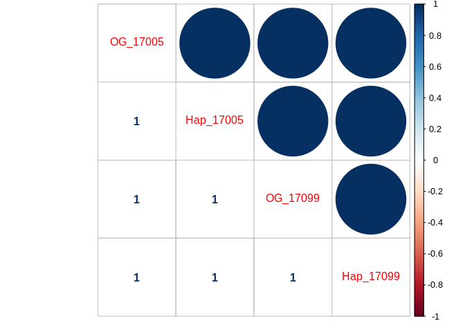

Two Sample RNA-seq sample comparison
================
adowneywall
7/9/2020

## STAR Mapping Comparison

<div style="border: 1px solid #ddd; padding: 0px; overflow-y: scroll; height:250px; overflow-x: scroll; width:800px; ">

<table class="table" style="margin-left: auto; margin-right: auto;">

<thead>

<tr>

<th style="text-align:left;position: sticky; top:0; background-color: #FFFFFF;">

</th>

<th style="text-align:left;position: sticky; top:0; background-color: #FFFFFF;">

Sample\_Unique

</th>

<th style="text-align:left;position: sticky; top:0; background-color: #FFFFFF;">

Sample

</th>

<th style="text-align:left;position: sticky; top:0; background-color: #FFFFFF;">

Genome

</th>

<th style="text-align:left;position: sticky; top:0; background-color: #FFFFFF;">

Parameters

</th>

<th style="text-align:left;position: sticky; top:0; background-color: #FFFFFF;">

InputReads

</th>

<th style="text-align:left;position: sticky; top:0; background-color: #FFFFFF;">

UniqueReads

</th>

<th style="text-align:left;position: sticky; top:0; background-color: #FFFFFF;">

UniqueReadPercent

</th>

<th style="text-align:left;position: sticky; top:0; background-color: #FFFFFF;">

totalSplices

</th>

<th style="text-align:left;position: sticky; top:0; background-color: #FFFFFF;">

MisMatchRate

</th>

<th style="text-align:left;position: sticky; top:0; background-color: #FFFFFF;">

MultiMapReads

</th>

<th style="text-align:left;position: sticky; top:0; background-color: #FFFFFF;">

MultiMapReadPercent

</th>

<th style="text-align:left;position: sticky; top:0; background-color: #FFFFFF;">

UnMappedMismatchPercent

</th>

<th style="text-align:left;position: sticky; top:0; background-color: #FFFFFF;">

UnMappedShortPercent

</th>

</tr>

</thead>

<tbody>

<tr>

<td style="text-align:left;">

1

</td>

<td style="text-align:left;">

17005\_Hap\_default

</td>

<td style="text-align:left;">

17005

</td>

<td style="text-align:left;">

Hap

</td>

<td style="text-align:left;">

default

</td>

<td style="text-align:left;">

29019229

</td>

<td style="text-align:left;">

23134476

</td>

<td style="text-align:left;">

79.7

</td>

<td style="text-align:left;">

25080333

</td>

<td style="text-align:left;">

1.08

</td>

<td style="text-align:left;">

1929366

</td>

<td style="text-align:left;">

6.65

</td>

<td style="text-align:left;">

0.00

</td>

<td style="text-align:left;">

13.0

</td>

</tr>

<tr>

<td style="text-align:left;">

3

</td>

<td style="text-align:left;">

17005\_Hap\_custom

</td>

<td style="text-align:left;">

17005

</td>

<td style="text-align:left;">

Hap

</td>

<td style="text-align:left;">

custom

</td>

<td style="text-align:left;">

29019229

</td>

<td style="text-align:left;">

23128293

</td>

<td style="text-align:left;">

79.7

</td>

<td style="text-align:left;">

25077651

</td>

<td style="text-align:left;">

1.08

</td>

<td style="text-align:left;">

1936988

</td>

<td style="text-align:left;">

6.67

</td>

<td style="text-align:left;">

0.00

</td>

<td style="text-align:left;">

12.9

</td>

</tr>

<tr>

<td style="text-align:left;">

5

</td>

<td style="text-align:left;">

17005\_original\_custom

</td>

<td style="text-align:left;">

17005

</td>

<td style="text-align:left;">

original

</td>

<td style="text-align:left;">

custom

</td>

<td style="text-align:left;">

29019229

</td>

<td style="text-align:left;">

21592189

</td>

<td style="text-align:left;">

74.4

</td>

<td style="text-align:left;">

23433957

</td>

<td style="text-align:left;">

1.05

</td>

<td style="text-align:left;">

3658588

</td>

<td style="text-align:left;">

12.6

</td>

<td style="text-align:left;">

0.00

</td>

<td style="text-align:left;">

12.0

</td>

</tr>

<tr>

<td style="text-align:left;">

2

</td>

<td style="text-align:left;">

17099\_Hap\_default

</td>

<td style="text-align:left;">

17099

</td>

<td style="text-align:left;">

Hap

</td>

<td style="text-align:left;">

default

</td>

<td style="text-align:left;">

29468692

</td>

<td style="text-align:left;">

23039810

</td>

<td style="text-align:left;">

78.1

</td>

<td style="text-align:left;">

24748387

</td>

<td style="text-align:left;">

1.10

</td>

<td style="text-align:left;">

2313982

</td>

<td style="text-align:left;">

7.85

</td>

<td style="text-align:left;">

0.00

</td>

<td style="text-align:left;">

13.2

</td>

</tr>

<tr>

<td style="text-align:left;">

4

</td>

<td style="text-align:left;">

17099\_Hap\_custom

</td>

<td style="text-align:left;">

17099

</td>

<td style="text-align:left;">

Hap

</td>

<td style="text-align:left;">

custom

</td>

<td style="text-align:left;">

29468692

</td>

<td style="text-align:left;">

23045655

</td>

<td style="text-align:left;">

78.2

</td>

<td style="text-align:left;">

24747168

</td>

<td style="text-align:left;">

1.10

</td>

<td style="text-align:left;">

2307283

</td>

<td style="text-align:left;">

7.83

</td>

<td style="text-align:left;">

0.00

</td>

<td style="text-align:left;">

13.2

</td>

</tr>

<tr>

<td style="text-align:left;">

15

</td>

<td style="text-align:left;">

17099\_original\_custom

</td>

<td style="text-align:left;">

17099

</td>

<td style="text-align:left;">

original

</td>

<td style="text-align:left;">

custom

</td>

<td style="text-align:left;">

29468692

</td>

<td style="text-align:left;">

21509701

</td>

<td style="text-align:left;">

72.9

</td>

<td style="text-align:left;">

23169681

</td>

<td style="text-align:left;">

1.07

</td>

<td style="text-align:left;">

3998499

</td>

<td style="text-align:left;">

13.5

</td>

<td style="text-align:left;">

0.00

</td>

<td style="text-align:left;">

12.3

</td>

</tr>

</tbody>

</table>

</div>

<!-- -->

## RSEM Comparison (sample 17005)

``` r
setwd("~/Github/updatedOysterTranscriptomeMappingComparison/")
OG_RSEM <- read.delim("data/samples/originalGenome_customParameters/17005_.genes.results.txt")
Hap_RSEM <- read.delim("data/samples/haploTigGenome_customParameters/17005.genes.results.txt")

OG_RSEM_17099 <- read.delim("data/samples/originalGenome_customParameters/17099_.genes.results.txt")
HAP_RSEM_17099 <- read.delim("data/samples/haploTigGenome_customParameters/17099.genes.results")
# TPM
tpmMat <- data.frame(OG_17005=OG_RSEM$TPM,Hap_17005=Hap_RSEM$TPM,
                     OG_17099=OG_RSEM_17099$TPM,Hap_17099=HAP_RSEM_17099$TPM)
# Length
lengthMat <- data.frame(OG_17005=OG_RSEM$length,Hap_17005=Hap_RSEM$length,
                        OG_17099=OG_RSEM_17099$length,Hap_17099=HAP_RSEM_17099$length)
# Expected Count
ExpCountMat <- data.frame(OG_17005=OG_RSEM$expected_count,Hap_17005=Hap_RSEM$expected_count,
                          OG_17099=OG_RSEM_17099$expected_count,Hap_17099=HAP_RSEM_17099$expected_count)
```

### CountSummary

``` r
#17005 - Number of genes with at least 1 TPM - original genome
sum(tpmMat$OG_17005 > 1)
```

    ## [1] 20598

``` r
#17005- Number of genes with at least 1 TPM - reduced genome
sum(tpmMat$Hap_17005 > 1)
```

    ## [1] 17908

``` r
#17099 - Number of genes with at least 1 TPM - original genome
sum(tpmMat$OG_17099 > 1)
```

    ## [1] 21869

``` r
#17099- Number of genes with at least 1 TPM - reduced genome
sum(tpmMat$Hap_17099 > 1)
```

    ## [1] 18976

### Correlations

**TPM (Transcripts Per
Million)**

``` r
corrplot.mixed(cor(tpmMat))
```

<!-- -->

**Gene
Length**

``` r
corrplot.mixed(cor(lengthMat))
```

<!-- -->

**Expected
Count**

``` r
corrplot.mixed(cor(ExpCountMat))
```

<!-- -->

### TPM - Plot (Sample 17005, custom parameters, genome comparison)

``` r
p1 <- ggplot(tpmMat,aes(x=OG_17005,y=Hap_17005)) + 
  geom_point() +
  labs(x="Original Genome (TPM)", y = "Reduced Genome (TPM)",title="All Loci") +
  theme_cowplot()

p2 <- ggplot(tpmMat,aes(x=OG_17005,y=Hap_17005)) + 
  xlim(0,200) + ylim(0,200) +
  labs(x="Original Genome (TPM)", y = "Reduced Genome (TPM)",title="Max 200") +
  geom_point() +
  theme_cowplot()

p3 <- ggplot(tpmMat,aes(x=OG_17005,y=Hap_17005)) + 
  xlim(0,50) + ylim(0,50) +
  labs(x="Original Genome (TPM)", y = "Reduced Genome (TPM)",title="Max 50") +
  geom_point() +
  theme_cowplot()

plot_grid(p1,p2,p3,nrow = 3)
```

    ## Warning: Removed 755 rows containing missing values (geom_point).

    ## Warning: Removed 3132 rows containing missing values (geom_point).

<!-- -->

### TPM - Plot (Sample 17099, custom parameters, genome comparison)

``` r
p1 <- ggplot(tpmMat,aes(x=OG_17099,y=Hap_17099)) + 
  geom_point() +
  labs(x="Original Genome (TPM)", y = "Reduced Genome (TPM)",title="All Loci") +
  theme_cowplot()

p2 <- ggplot(tpmMat,aes(x=OG_17099,y=Hap_17099)) + 
  xlim(0,200) + ylim(0,200) +
  labs(x="Original Genome (TPM)", y = "Reduced Genome (TPM)",title="Max 200") +
  geom_point() +
  theme_cowplot()

p3 <- ggplot(tpmMat,aes(x=OG_17099,y=Hap_17099)) + 
  xlim(0,50) + ylim(0,50) +
  labs(x="Original Genome (TPM)", y = "Reduced Genome (TPM)",title="Max 50") +
  geom_point() +
  theme_cowplot()

plot_grid(p1,p2,p3,nrow = 3)
```

    ## Warning: Removed 688 rows containing missing values (geom_point).

    ## Warning: Removed 3086 rows containing missing values (geom_point).

<!-- -->

## Comparing among samples

To evaluate the impact of the genome mapping among samples I calculated
the difference in coverage (TPM) between genome mapping approaches and
examine whether this value difference among samples. The difference
discussed below was calculated as:

\[(X_{TPM,Hap})_{i}-(X_{TPM,OG})_{i}\]  
Where \(X\) is the sample, and \(i\) is the gene.

### All Genes

**Absolute difference - All
genes**

``` r
plot(c(abs(tpmMat$Hap_17005-tpmMat$OG_17005))~c(abs(tpmMat$Hap_17099-tpmMat$OG_17099)),
     xlab="TPM difference 17099",ylab="TPM difference 17005")
abline(a=0,b = 1,col="red")
```

<!-- -->

**Absolute difference - coverage \<
500**

``` r
plot(c(abs(tpmMat$Hap_17005-tpmMat$OG_17005))~c(abs(tpmMat$Hap_17099-tpmMat$OG_17099)),
     xlab="TPM difference 17099",ylab="TPM difference 17005",
     xlim=c(0,200),ylim=c(0,200))
abline(a=0,b = 1,col="red")
```

<!-- -->

**Absolute difference - coverage \<
50**

``` r
plot(c(abs(tpmMat$Hap_17005-tpmMat$OG_17005))~c(abs(tpmMat$Hap_17099-tpmMat$OG_17099)),
     xlab="TPM difference 17099",ylab="TPM difference 17005",
     xlim=c(0,50),ylim=c(0,50))
abline(a=0,b = 1,col="red")
```

<!-- -->

**Proportion difference (adjusted by max TPM)**

``` r
library(matrixStats)
```

    ## 
    ## Attaching package: 'matrixStats'

    ## The following object is masked from 'package:dplyr':
    ## 
    ##     count

``` r
hapProp_17005 <- c(tpmMat$Hap_17005-tpmMat$OG_17005)/rowMaxs(as.matrix(tpmMat[,1:2]))
hapProp_17099 <- c(tpmMat$Hap_17099-tpmMat$OG_17099)/rowMaxs(as.matrix(tpmMat[,3:4]))

plot(hapProp_17005~hapProp_17099,
     xlab="Prop TPM difference 17099",ylab="Prop TPM difference 17005")
abline(a=0,b=1,col="red",lwd=2)
```

<!-- -->

### Filter dataset

Looking at genes with moderate coverage (diff TPM \>= 1 in at least 1
sample/mapping)

``` r
#Filter gene with no coverage in either samples
minCov_all <- which(rowMins(as.matrix(tpmMat)) >= 1)
tpmMat_filt <- tpmMat[minCov_all,]

diff_17005 <- abs(tpmMat_filt$Hap_17005 - tpmMat_filt$OG_17005)
diff_17099 <- abs(tpmMat_filt$Hap_17099 - tpmMat_filt$OG_17099)
```

**Absolute difference - All genes**

``` r
plot(diff_17005~diff_17099,
     xlab="TPM difference 17099",ylab="TPM difference 17005")
abline(a=0,b=1,col="red")
```

<!-- -->

**Absolute difference - coverage \< 100**

``` r
plot(diff_17005~diff_17099,xlim=c(0,100),ylim=c(0,100),
     xlab="TPM difference 17099",ylab="TPM difference 17005")
abline(a=0,b=1,col="red")
```

<!-- -->

**Absolute difference - All genes (log transformed)**

``` r
plot(log(diff_17005)~log(diff_17099),
     xlab="TPM difference 17099 (log)",ylab="TPM difference 17005 (log)")
abline(a=0,b=1,col="red")
```

<!-- -->

**Number of genes with log-tpm fold \> 2 among samples**

``` r
## Sum 
sum(abs(log(diff_17005)-log(diff_17099))>2)
```

    ## [1] 774
